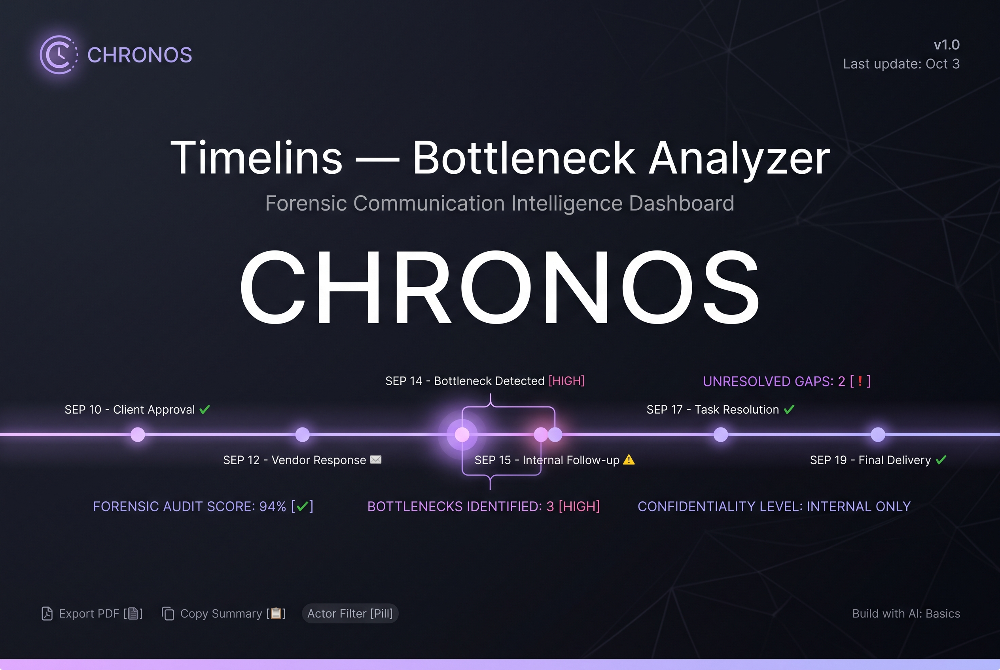

# Chronos — Timeline & Bottleneck Analyzer



Chronos is a proof of concept for turning scattered operational communications into a readable case view. It combines emails, chat exports, and pasted notes, then helps a user identify missing context, reconstruct a timeline, surface possible bottlenecks, and prepare next steps.

Built for the **Build with AI: Basics** hackathon, Chronos focuses on one complete workflow rather than attempting to be a production case-management system.

## The problem

When a project, procurement process, or dispute stalls, the relevant facts are often split across email threads, chat messages, and informal notes. It takes time to establish what happened, which document or approval is missing, and what should happen next.

Chronos is designed for commercial, operations, and legal professionals who need a fast first reading of that material.

## What the prototype does

1. **Collects case material** from pasted text and locally selected files.
2. **Checks for missing context** such as references to a message, meeting, or document that may not be in the material supplied.
3. **Builds a timeline** of the significant events, with the source excerpt for each event.
4. **Highlights possible bottlenecks** and proposes a prioritized action list.
5. **Filters the timeline by person**, copies an executive summary, and produces a browser print view that can be saved as a PDF. The user can include only the timeline, bottlenecks, or actions in that export.

The included sample case follows a supplier delivery block caused by an unpaid invoice and a missing Legal approval. It is the quickest way to see the full flow.

## Current scope and limits

Chronos is an early, client-side prototype. It is useful for exploring a case and preparing a first operational discussion; it is not a source of legal advice or an authoritative record of events.

- The reliable input paths today are pasted text, `.txt`, and simple text-based `.eml` files. The interface also accepts `.msg` and `.pdf`, but the prototype reads them as text and does not yet include dedicated Outlook MSG or PDF extraction.
- With a configured Gemini key, the app sends the combined text to Gemini for the context check and the analysis.
- Without a key, it displays a deterministic demonstration result so that the interaction can still be shown. That fallback is for the sample/demo experience and must not be treated as an analysis of arbitrary uploaded material.
- The model is asked for JSON and direct source excerpts, but model outputs still need human review. Chronos does not independently verify every conclusion against the documents.
- Files are processed in the browser and are not saved by Chronos. This prototype has no user accounts, database, collaboration features, or live Outlook/Teams integrations.

## Run locally

### Prerequisites

- Node.js 18 or later
- A Gemini API key if you want live AI analysis

### Setup

```bash
npm install
```

Create a `.env` file in the project root:

```bash
VITE_GEMINI_API_KEY=your_gemini_api_key
# Optional: defaults to gemini-2.5-flash
VITE_GEMINI_MODEL=gemini-2.5-flash
```

Start the app:

```bash
npm run dev
```

Open the local URL shown by Vite, usually `http://localhost:5173`.

To create a production build:

```bash
npm run build
```

## Try the sample case

1. Select **Load Sample Dispute Case**.
2. Select **Analyze Case & Verify Gaps**.
3. Review the context check and select **Proceed to Forensic Dashboard** when prompted.
4. Explore the timeline, source excerpts, bottlenecks, and recommended actions.
5. Use **Export PDF Report** to select the report sections and open the print dialog.

## Privacy and GDPR considerations

The hackathon prototype deliberately keeps the architecture small, but this does **not** make it appropriate for confidential production use. When live analysis is enabled, the selected text is sent directly from the browser to the configured Gemini API endpoint. Do not upload privileged material, personal data, customer records, contracts, or internal communications unless you have confirmed that this is permitted by your organisation and your AI provider arrangement.

Before a production rollout, Chronos would need a privacy and security design appropriate to the organisation and use case, including:

- a lawful basis and documented data-flow assessment;
- data minimisation, retention rules, and clear user notices;
- local or server-side redaction/tokenisation of personal and sensitive information before model processing;
- enterprise identity, access controls, audit logs, and encryption;
- an approved processor agreement and a deployment region/data-retention model that meet the organisation's GDPR obligations;
- human review and escalation rules for material operational or legal decisions.

These are future product requirements, not features implemented by this repository.

## Future directions

The next useful improvements would be dedicated PDF and MSG parsers, a clear evidence-to-claim review step, re-analysis after a user adds missing material, and optional integrations with approved Outlook/Teams or document-management systems. A production edition could support a private model gateway or approved regional deployment, but Chronos is not currently model-provider agnostic or air-gapped.

## Technical outline

- Vanilla JavaScript, HTML, and CSS
- Vite development and build tooling
- Gemini REST API with JSON responses for the two analysis phases
- Browser-native printing for PDF export
- Local SVG icon set and responsive light/dark interface

The planning documents required for the hackathon are in [`devpost/`](devpost/): [`scope.md`](devpost/scope.md), [`prd.md`](devpost/prd.md), and [`spec.md`](devpost/spec.md).

## License

MIT. Created for the Build with AI: Basics hackathon.
